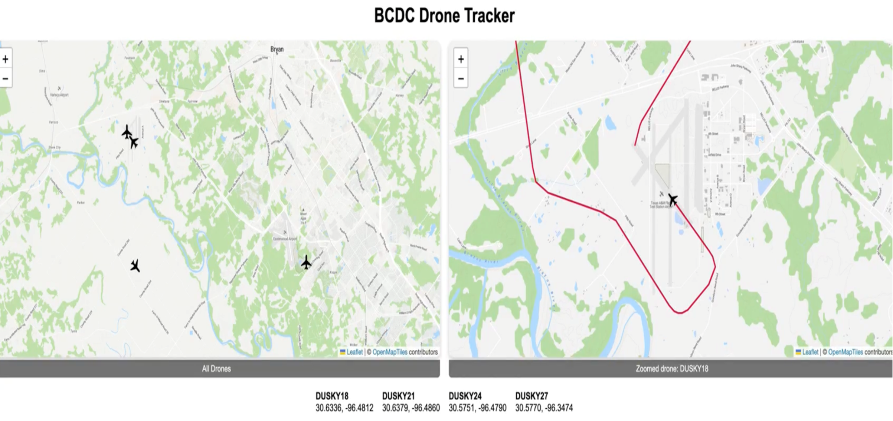
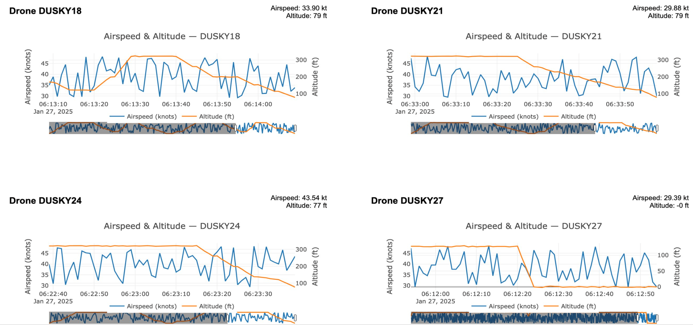

# Autonomous Drone Combat Display System

Overview
--------
This project implements a real time combat display and analytics system for tracking autonomous drones during research and testing operations. The system ingests live telemetry data from multiple unmanned platforms, processes it through a Python-based API, and visualizes drone positions and performance metrics via an interactive web interface. This was built for the [Bush Combat Development Complex](https://bcdc.tamus.edu/) in coordination with Corpus Christi's [Autonomy Research Institute](https://www.tamucc.edu/autonomy-research-institute/)

The primary goals of this project were:

- real time situational awareness for autonomous systems
- low latency telemetry ingestion and visualization
- scalable architecture for research and operational experimentation

this system was designed and built from scratch to support autonomy research and operational analysis

## Screenshots

### Analytics Dashboard

### Individual Drone View

System Architecture
-------------------

At a high level, the system consists of:

- **Telemetry Ingestion API (Python)**
  receives live telemetry streams from autonomous drones, validates incoming data, and processes updates for downstream visualization

- **Real Time Visualization Frontend**
  interactive web based combat display map showing live drone positions, status, and mission data

- **Analytics and Statistics Dashboard**
  displays per drone performance metrics using live updating graphs to support trend analysis and post test evaluation

Architecture Flow:

    Autonomous Drones
            |
            v
    Python Telemetry API
            |
            v
    Real-Time Data Pipeline
            |
      +-----+-----+
      |           |
      v           -- v
    Interactive     Analytics and
    Combat Display  Statistics
    Map             Dashboard

Key Features
------------

- real time tracking of multiple autonomous drones
- live geospatial visualization of drone positions
- low latency telemetry updates
- Per drone statistics and performance analytics
- continuously updating graphs and metrics
- modular and extensible system design

Telemetry Data
--------------

The API is designed to ingest structured telemetry data, including but not limited to:

- drone identifier
- latitude, longitude, and altitude
- velocity and heading
- timestamped status updates
- mission or research specific data fields

The system is extensible and can support additional telemetry formats and autonomous platforms with minimal modification.

Technologies Used
-----------------

- **Backend**: Python (REST API, telemetry processing)
- **Frontend**: web based interactive visualization (HTML, JavaScript, CSS)
- **Data Visualization**: live updating charts and graphs (Jinja2, Plotly)
- **Networking**: real time data streaming and low latency updates

Use Cases
---------

- monitoring autonomous drone behavior during live testing
- supporting real time situational awareness for research teams
- analyzing performance metrics and trends across multiple platforms
- providing a foundation for future autonomy and command and control visualization tools

Project Status
--------------

This project is intended for research and educational purposes. It is not designed for production deployment or operational combat use, ie make sure that you test everything if you intend to use it.

Further Infomation
----------

This repository contains no classified, sensitive, or restricted information - all sensitive info has been redacted.
If interested, please contact me, I can answer any of your questions to the best of my ability!

